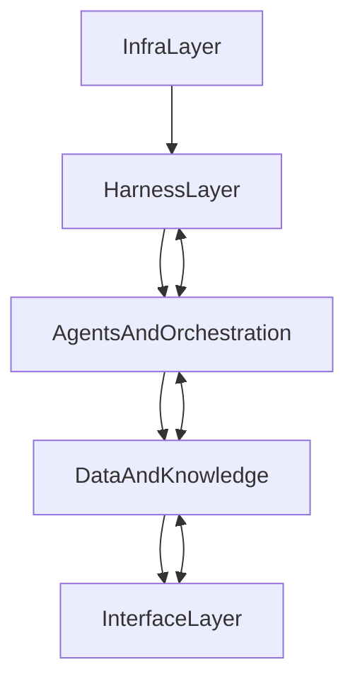
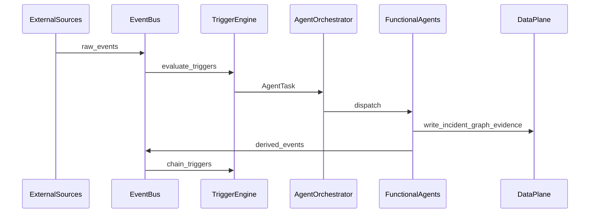

# AI Security Teams：系统级高层工程架构设计

> 本文档将 [AI_Security_Teams_Architecture_and_Benchmarking.md](./AI_Security_Teams_Architecture_and_Benchmarking.md) 中的概念体系（6+1 Agents、Clawsentry V3.0 Harness、Deep Agent、事件驱动闭环）收敛为**可工程落地**的平台级架构：分层视图、子系统边界、关键数据/事件流、部署拓扑、SLO 与可观测性映射，以及分阶段落地路线。  
> **范围**：模块划分、事件总线与数据流、Agent 编排与安全 Harness 集成、对外集成与部署形态。  
> **非范围**：具体模型选型、代码级 API 契约、特定云厂商绑定。

---

## 1. 目标与范围

### 1.1 目标

- 将 **6+1 多智能体**、**Clawsentry V3.0 Harness**、**Deep Agent（五大数据域 + 证据链）**、**事件驱动闭环** 映射为可实现的子系统与交互关系。
- 明确 **核心子系统边界** 与 **主要交互面**（事件、任务、数据、人机审批），供后续详细设计（Agent 状态机、Skill 实现、具体存储选型）引用。

### 1.2 范围与非范围

| 纳入 | 不纳入（后续迭代） |
| :--- | :--- |
| 平台分层、子系统清单、主干事件/数据流 | 具体 LLM/嵌入模型与提示词模板 |
| Harness 组件职责与集成形态（Sidecar + 中央服务） | 各连接器与第三方产品的 SDK 级字段映射 |
| 部署域划分、长程任务与 checkpoint 原则 | 单一集群的节点规格与成本测算 |
| SLO 与可观测性、审计的**采集与计算锚点** | 合规框架（如等保条款）逐项对照表 |

---

## 2. 顶层分层架构（L1：架构/基因）

自下而上分为五层；上层依赖下层提供的安全与数据能力。

| 层级 | 名称 | 职责摘要 |
| :--- | :--- | :--- |
| L0 | **基础设施与运行时** | 计算/网络/存储、容器编排（如 Kubernetes）、通用日志与指标基础设施。 |
| L1 | **安全 Harness（Clawsentry V3.0）** | 提示词免疫、身份与通信（Arkclaw）、凭证虚拟化、沙箱、Agent WAF、AgentArmor、任务持久化与 checkpoint。 |
| L2 | **智能体与编排** | EventBus、TriggerEngine、AgentOrchestrator、6+1 Agent 服务与 Active Agent 订阅。 |
| L3 | **数据与知识平面** | 实体图谱（五大数据域）、证据链存储、跨源检索与时间线、威胁情报与规则库。 |
| L4 | **接口与体验** | SOC 控制台、审批流、Public API/Webhook、与 SIEM/EDR/CMDB/IAM/CI/CD 的连接器。 |

**设计要点**：

- 所有 Agent 与 Orchestrator 的出站 LLM 调用、工具调用、高风险执行路径 **必须经过 Harness**（本地 Sidecar 代理 + 中央策略/身份服务）。
- **Active Agent**（如 Intel、Baseline）通过 EventBus + TriggerEngine **自主订阅**外部情报流或内部状态变更，与文档中「7x24 自主激活」一致。
- **长程任务可靠性**：任务状态与 checkpoint 由 Orchestrator 与 Harness 状态机协同持久化；Worker 重启后可恢复，满足「全网巡检」类场景。

---

## 3. 子系统与模块划分

### 3.1 安全 Harness 子系统（Clawsentry V3.0）

| 模块 | 职责 | 与上层的接口形态 |
| :--- | :--- | :--- |
| **PromptImmunityService** | 统一 LLM 入站/出站过滤、敏感信息策略、提示词注入/越狱检测；审计全量模型 I/O。 | Agent 内 `LLMAdapter` 仅连接本模块，不直连公网模型端点（可经企业网关）。 |
| **ArkclawIdentityService** | Agent 实例身份签发、轮换、mTLS/令牌校验；服务间与 Agent 间双向认证；**最小权限**策略绑定到任务上下文。 | Sidecar 与中央服务校验每个 RPC/消息的身份与 scope。 |
| **CredentialVirtualizationService** | 抽象 `ResourceHandle`（如「某租户的只读 CMDB 切片」），代理真实凭证获取与轮换；Agent **不接触明文密钥**。 | Skill 层只申请 capability，由 Harness 注入短期凭证或代发请求。 |
| **SandboxManager** | 为 Pentest、未知样本分析等创建 **阅后即焚** 隔离运行时；网络策略与销毁流程可审计。 | Orchestrator 将「需在沙箱执行」的步骤调度到沙箱 Worker。 |
| **AgentWAFGateway** | Active Agent 出入站流量代理；基于身份 + 意图 + 行为基线的异常检测、限流、外联域名/IP 策略。 | 出站 HTTP(S)/DNS 等经网关；策略由安全团队集中管理。 |
| **AgentArmorEngine** | 对 Agent 产出的 **Intent/Plan/控制流** 做静态与运行时校验；偏离授权意图则拒绝或转 **人工审批**。 | Response 等高危 Agent 的执行图必经 Armor 裁决。 |
| **TaskPersistence / Checkpoint** | 与 Orchestrator 对齐的长任务分段、持久化状态、恢复点；保证最终一致性语义（与业务定义的幂等策略一致）。 | Orchestrator 读写 checkpoint 存储；Harness 记录审计链。 |

**集成方式**：每个 Agent/Orchestrator Pod 部署 **Harness Sidecar**（本地代理、策略缓存、轻量过滤），中央部署身份、凭证、Armor 策略、沙箱编排等 **控制面服务**。

### 3.2 事件总线与编排子系统

| 模块 | 职责 |
| :--- | :--- |
| **EventBus** | 持久化消息骨干（Kafka/Pulsar 等同类能力）；Topic 按域划分（如 `raw.alerts`、`intel.normalized`、`incident.lifecycle`、`workflow.signals`）；**强 Schema**（Avro/Protobuf/JSON Schema）便于演进与兼容。 |
| **TriggerEngine** | 声明式/可版本管理的规则：将业务事件映射为 `AgentTask`（目标 Agent 类型、优先级、输入句柄、SLA、所需 capability）；支持事件关联与防抖。 |
| **AgentOrchestrator** | 任务队列与调度、并发与配额、**状态机**（Pending / Running / WaitingHuman / Halted / Completed / Failed）、重试与死信队列、与 checkpoint 协同；向 SOC 暴露任务与人工卡点状态。 |

**内部任务对象（概念）**：`AgentTask` 至少包含：`task_id`、`agent_type`、`trigger_event_ids`、`input_refs`（对象存储或数据平面句柄）、`policy_context`（Armor/权限范围）、`sla_tier`、`idempotency_key`。

### 3.3 6+1 Agents 服务层

每个职能对应独立可伸缩服务（或独立 Deployment + 共享库），统一内部结构：

| 内部组件 | 职责 |
| :--- | :--- |
| **TaskHandler** | 消费 Orchestrator 分配的任务；解析上下文与输入引用。 |
| **SkillInvoker** | 调用注册 Skills（工具）；所有外部系统访问经 Harness（凭证、WAF、审计）。 |
| **LLMAdapter** | 封装推理与结构化输出；**仅**通过 PromptImmunity。 |
| **LocalStateStore** | 会话级/任务级缓存；与 checkpoint 协调写入持久化。 |

**服务清单**：

- `IntelAgentService`、`TriageAgentService`、`PentestAgentService`、`BaselineAgentService`、`DevSecAgentService`、`ResponseAgentService`
- `ReflectionAgentService`（元智能体）：额外包含 **MetricCollector**（拉取 SLO 与审计聚合）、**RCAEngine**（根因与流程缺陷分析）、**KnowledgeUpdateProposer**（生成知识库/规则/触发器变更建议，经治理流程生效）。

**Deep Agent**：可作为 **Response 内嵌模式** 与 **独立 DeepTrace 服务** 两种形态；工程上推荐 **独立服务** 便于资源隔离与证据链治理，由 Response 发起 `DeepTraceRequest`。

### 3.4 数据与知识平面

| 模块 | 职责 |
| :--- | :--- |
| **EntityGraphService** | 五大数据域：**资产、账号、数据、供应链、权限** 的统一标识、关系与版本；供 Triage/Deep/Reflection 查询与扩展。 |
| **EvidenceChainStore** | 证据块哈希、链式签名（或等价防篡改机制）、与调查结论的绑定；满足可追溯与合规留存。 |
| **AnalyticsAndSearchService** | 跨日志/遥测的统一检索、时间线对齐、实体解析；Deep Agent 的主要读路径之一。 |
| **ThreatIntelRepository** | IOC/TTP/漏洞情报的结构化存储与订阅输出。 |
| **RuleRepository** | 检测规则、SDLC 规则与测试用例、虚拟补丁/WAF 规则版本与生效范围。 |

### 3.5 接口与体验层

| 模块 | 职责 |
| :--- | :--- |
| **SOCConsole** | 事件与调查视图、实体图谱与时间线可视化、任务与 SLA 面板、**人工审批**（Armor 卡点）、指标仪表盘（含 SOAE 相关输入指标）。 |
| **IntegrationConnectors** | SIEM、EDR、NTA、CMDB、IAM、CI/CD 等双向集成；归一化为内部事件与图谱更新。 |
| **PublicAPI & Webhook** | 对外 REST/gRPC 与回调；与现有 SOAR/ITSM 对接。 |

---

## 4. 核心数据流与事件流

### 4.1 告警与情报驱动的主干闭环

1. 外部情报源 / 连接器写入 SIEM/EDR 事件 → **EventBus**（`raw.*` Topic）。
2. **TriggerEngine** 匹配规则 → 生成 `AgentTask` → **AgentOrchestrator** 入队。
3. 优先路径：原始信号 → **Intel**（结构化预警）或 **Triage**（富化、关联、可信度评分）→ 产出 **高置信度 Incident** 对象写入数据平面并发布 `incident.*` 事件。
4. 下游 **Pentest / Baseline / DevSec / Response** 订阅 `incident.*` 或更细粒度 Topic，**并行或串行**触发（由 TriggerEngine 工作流定义）。
5. **Response** 完成后发布 `incident.closed`；**Reflection** 订阅生命周期事件与审计流做复盘。

### 4.2 Deep Agent 溯源流

1. **ResponseAgent**（或分析师从控制台）发起 `DeepTraceRequest`（`incident_id`、种子实体、时间窗、数据域范围）。
2. **DeepAgent** 调用 **AnalyticsAndSearchService** 拉取多源原始事件；以 **EntityGraphService** 扩展子图。
3. 产出：**异常实体图谱**、**跨域统一时间线**、**战术意图推断**（可与 MITRE ATT&CK 标签对齐）；原始引用写入 **EvidenceChainStore**（哈希 + 签名 + 结论绑定）。
4. 摘要回写 Incident 记录，并在 **SOCConsole** 展示；供 Response 动作与 Reflection 复盘使用。

### 4.3 Reflection Agent 反馈与迭代流

- **输入**：结构化审计日志（决策、工具调用、Armor 结果）、各阶段任务耗时、SLO 指标、人工复核标签、红队/事后审计样本。
- **输出**（经治理流程生效，避免自动越权修改生产）：
  - TriggerEngine 规则与路由优化建议；
  - Skill 配置/权重/阈值建议；
  - RuleRepository / ThreatIntelRepository / 巡检策略的变更工单或自动 PR（与 DevSec 流水线集成）。

---

## 5. 部署拓扑与运行时形态

### 5.1 云原生部署建议

- **Kubernetes** 承载 Orchestrator、各 Agent、Harness 控制面、数据平面 API 网关。
- **沙箱与高负载分析**（Pentest、Deep 批量关联）使用 **独立节点池或独立集群**，严格 **NetworkPolicy** / 服务网格策略，默认拒绝横向访问。
- **AuditLogPipeline**：全量 Agent 决策与 Harness 裁决 → 不可篡改存储（对象存储 WORM 或合规审计专用集群）+ 长期检索索引。

### 5.2 安全域划分（示例）

| 安全域 | 内容 | 暴露面 |
| :--- | :--- | :--- |
| **control-plane** | Orchestrator、TriggerEngine、Arkclaw、Armor、策略控制台 | 仅运维与平台 API；强 RBAC |
| **data-plane** | 图谱、检索、证据链 API、情报与规则库 | 仅内网与服务账号；经 CredentialProxy |
| **sandbox-zone** | SandboxManager 工作负载 | 受限出网；经 AgentWAF |
| **integration-zone** | 对外连接器、Webhook 入口 | WAF、速率限制、双向 TLS |

---

## 6. 可观测性与 SLO 映射

### 6.1 指标采集锚点

| 文档指标 | 建议采集方式 |
| :--- | :--- |
| **MTTD** | 在 **EventBus/Orchestrator** 记录「威胁相关首次有效检测事件」时间戳（需与业务定义对齐：传感器首报 vs 系统确认）。 |
| **MTTR** | 从 **Incident 确认**（Triage 状态迁移或人工确认点）到 **Response 关闭/恢复完成** 的时长。 |
| **FPR** | Triage 判定为真阳 → 后续 **人工或 Reflection 标签** 为误报的占比。 |
| **FNR** | 依赖 **红队、事后审计、漏报工单** 与检测日志对比（需离线评估管道）。 |
| **止损覆盖率** | 已知攻击模式集合 vs 已进入 **RuleRepository**（SAST/DAST/虚拟补丁等）的比例。 |
| **巡检覆盖率** | **Baseline** 任务覆盖的核心资产集合 / CMDB 核心资产全集。 |
| **渗透成功/阻断率** | **Pentest** 在受控目标上的结果统计 vs 防御设备/策略日志。 |
| **SOAE** | 从 Orchestrator 的自动化节点完成标记、人工工时工单、模型/沙箱成本账单聚合计算。 |

### 6.2 审计与可追溯性

- 每笔 **LLM 调用**（经 PromptImmunity）、**Skill 调用**（参数摘要与结果摘要）、**Agent 间消息**、**Armor 允许/拒绝** 均写入 **结构化审计事件**，带 `trace_id` / `incident_id`。
- **可信度分数**（Triage）作为事件字段持久化，供控制台排序与 Reflection 分析。
- 证据链存储与审计日志 **分离职责**：前者面向调查与司法有效性质保，后者面向全系统行为合规。

---

## 7. 渐进式落地路线

### 阶段 1：基础平台与部分 Agent MVP

- 落地 **Kubernetes + EventBus + Orchestrator** 骨架；Harness **MVP**：Arkclaw 身份、CredentialProxy、审计管道。
- 优先上线 **Intel、Triage、Baseline**；打通 SIEM/CMDB/IAM 只读集成；实现「情报/告警 → 富化 → 基线专项任务」的最小闭环。

### 阶段 2：Deep Agent 与主动防御扩展

- 上线 **DeepTrace 服务 + EvidenceChainStore**；**Response** 与证据链打通。
- 引入 **Pentest**（沙箱强制执行）与 **DevSec**（规则/用例进入 CI 的治理流程）；形成「事件 → 验证 → 左移规则」的初版闭环。

### 阶段 3：Reflection 驱动的自进化体系

- 完整 **ReflectionAgent**；SLO 仪表盘与 Drive-Resistance 评审节奏固化（如双周）。
- TriggerEngine / Skill / 规则库的变更走 **版本化 + 审批 + 灰度**；实现文档所述「复盘与进化」的工程闭环。

---

## 8. 与主文档的对应关系

| 主文档章节 | 本文档承接方式 |
| :--- | :--- |
| §2 6+1 Agents 与工作流 | §3.3 服务划分 + §4 事件流实例化 |
| §3 Clawsentry Harness | §3.1 模块级工程映射 |
| §4 Deep Agent 与五大数据域 | §3.4 + §4.2 |
| §5 SLO/审计/合规 | §6 + Harness/凭证/PII 在 §3.1、§5 中的工程落点 |
| §6 方法论（L1–L4、SOAE） | §2 分层对应 L1/L4；§6.1 支撑 SOAE 数据采集 |

---

*文档版本：与架构实施计划同步的初版工程蓝图；后续可在本仓库增加 OpenAPI、事件 Schema 与 Agent 状态机专篇。*
